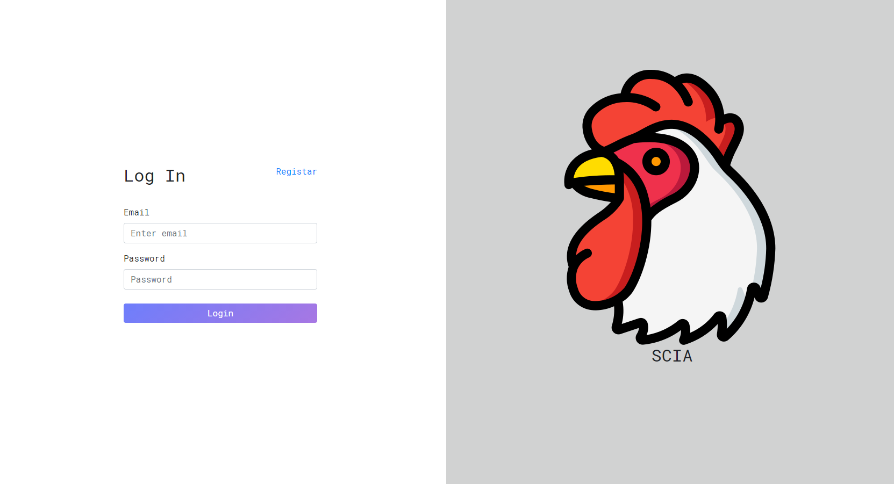
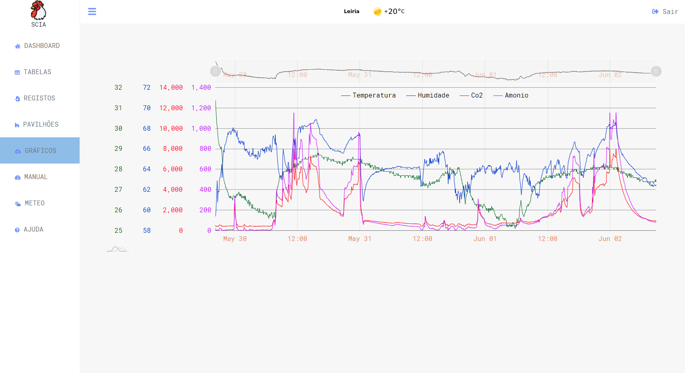
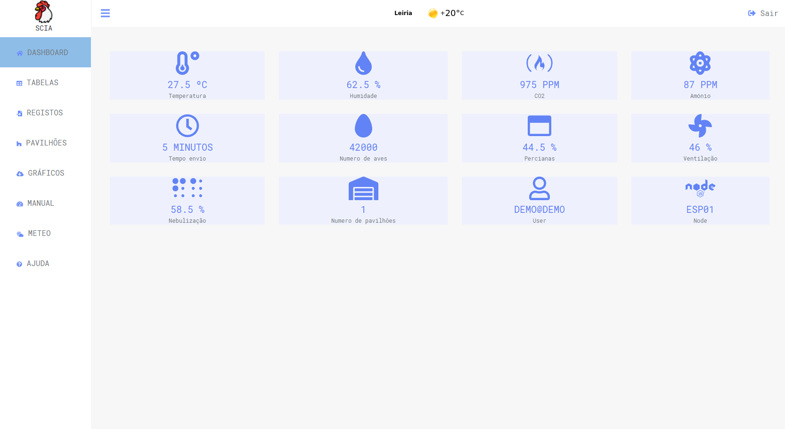
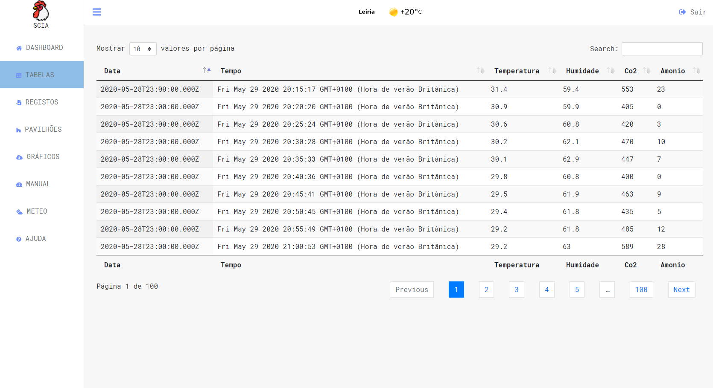

<p align="center">
   
</p>
<p align="center">	
   <a href="https://www.linkedin.com/in/romeuvicente/">
      
   </a>
  
</p>

> :rocket: Final project to visualize quantities in aviaries and their respective control, @ESTG

<p align="center">
    <a href="README.md">English</a>
    ·
    <a href="README-pt.md">Portuguese</a>
 </p>

<div align="center">
  <sub>The final project. Built with ❤︎ by
    <a href="https://github.com/Romeuv">Romeu Vicente</a>
  </sub>
</div>

# :pushpin: Table of Contents
* [Technologies](#computer-technologies)
* [Features](#rocket-features)
* [How to execute](#construction_worker-how-to-execute)
* [Found a bug?](#boom-Bugs)
* [License](#closed_book-license)

### Web Screenshot
<div style="display: flex; flex-direction: 'row'; align-items: 'center';">
   
   
</div>

<div style="display: flex; flex-direction: 'row';">
   
   
</div>

# :computer: Technologies
This project was made using the follow technologies:

* [Javascript](https://www.javascript.com/)      
* [Amcharts](https://www.amcharts.com/)      

# :rocket: Features

* Website for registering and viewing orphanages.
* App to registering and viewing orphanages.

# :construction_worker: How to execute
```bash
# Clone Repository
$ git clone https://github.com/Romeuv/Happy.git
```

### 💻 Execute Web Project

```bash
# Go to web folder
$ cd Scia

# Run Aplication
$ index.html
```
Go to http://localhost:3000/ to see the result.

# :boom: Bugs

Found a bug? **Create a new issue** with the respective title and description on the bug page of [Scia] (https://github.com/Romeuv/Scia/issues) Repository. If you have already found a solution to the bug, **give your pull request**.

# :closed_book: License

Released in 2020 :closed_book: License

Made by [Romeu Vicente](https://github.com/Romeuv) 🚀.
This project is under the [MIT license](./LICENSE).
